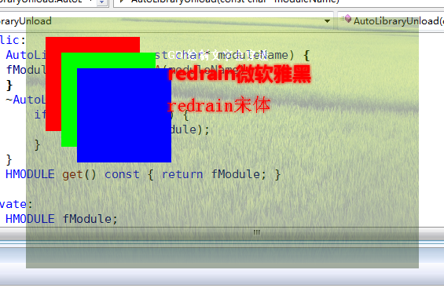

# skia_vs2008

###include、src目录

这两个目录是skia的源文件，我在src\core目录中附带了VS2008编译skia所需要的stdint.h头文件，其他文件除了为了支持VS2008做过微量修改外，没有任何重大修改。

###third_party目录

在使用官方介绍的gyp生成解决方案的方法中，编译过程需要用到第三方库，**third_party\externals**目录就是编译官方方法的VS2008到VS2012版本的Skia所需要的第三方库，把这个目录放到你的Skia的对应目录就可以。这里都是我整理好的第三方库。

###out_2008目录

是我利用gyp生成好的VS2008的解决方案，配合third_party目录的第三方库可以用来编译skia。不过这种官方版本的解决方案会把skia拆分为很多个静态库，生成的文件比较零散。

###cmake_2008目录

是我参照最新版的skia的CMakeLists.txt文件，经过修改后做成了适用于旧版本的CMakeLists.txt文件，然后生成了VS2008解决方案。然后对解决方案进行了一些修改，有了这个最终的解决方案。这个是我比较喜欢的解决方案，不依赖third_party的第三方库，只需要include和src目录的源文件就可以直接生成单一文件的skia。可以是静态库或者动态库。建议使用静态库，因为动态有一些类未导出。

###skiatest目录

为cmake_2008目录的静态库skia做的一个demo，为了简单测试skia的功能，可以直接编译。

####by:Redrain  2016.4.28**
####QQ:491646717
####blog:[http://blog.csdn.net/zhuhongshu/article/details/51272050](http://blog.csdn.net/zhuhongshu/article/details/51272050)

